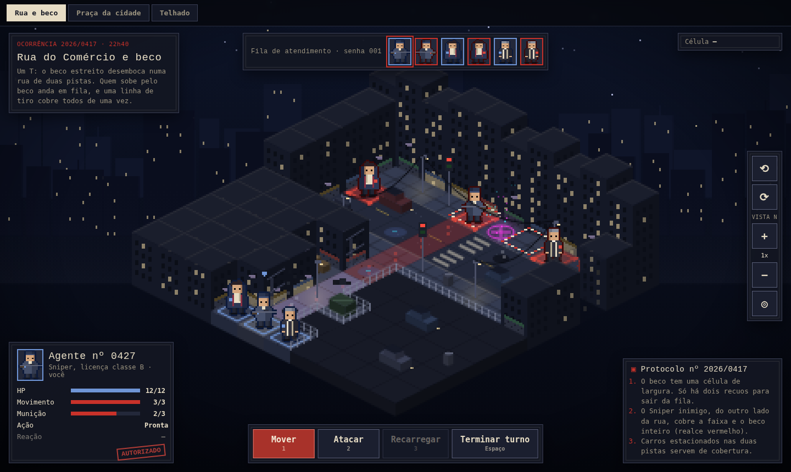
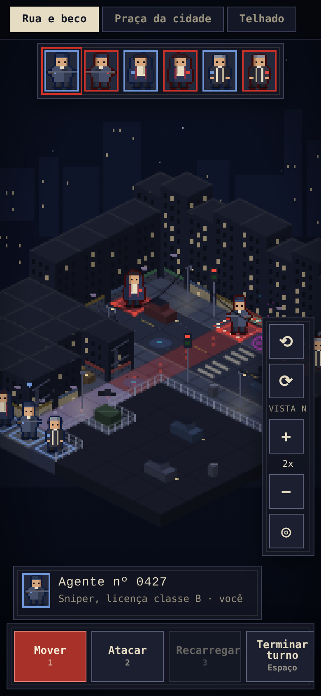
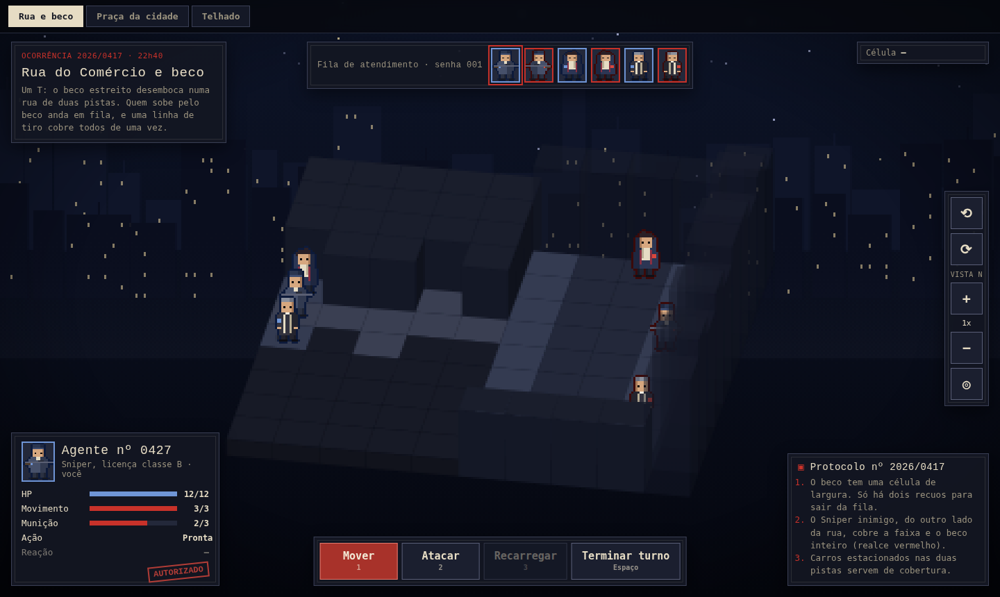
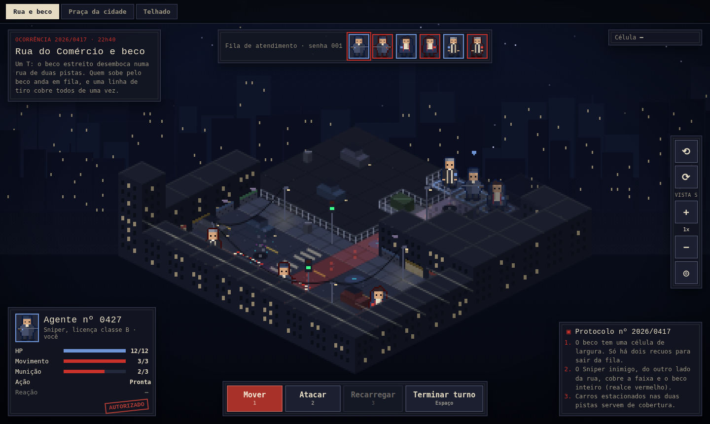

# Eldritch Alley: Tactics, camera and mobile controls (handoff)

Prototype of the battle map camera: pan, zoom and 90° rotation, on desktop and on mobile, applied to the three approved maps (street and alley, city park, rooftop). It is a reference for the game client, not production code: it shows the map and units, but no actions are executed.

Handoff target: Claude Code, in the `eldritch-alley` repository. Follow `CLAUDE.md`: plan first, small diffs, no commits or pushes.

Related tickets: **EA-12** (camera), **EA-3** (turn indicator), **EA-6** (enemy ranges on hover or tap), **EA-7** (multi-cell movement), **EA-8** (attack by clicking the sprite or portrait). It builds on the earlier handoffs: `eldritch-alley-map-prototype` (maps and art direction) and `eldritch-alley-characters-v1` (sprites).



## Contents

```
index.html            markup: map tabs, canvas, HUD and the camera control panel
css/styles.css        HUD, camera panel and the mobile layout (media queries)
js/maps-camera.js     maps, renderer, v1 sprites, camera, rotation, input handling
screenshots/          views N and S, rotation in progress, zoom 2x, rooftop, mobile portrait
```

Open `index.html` directly in a browser, or serve the folder to test on a phone on the same network (`npx serve .`). UI strings are in Portuguese; translate when moving into the client.

## 1. Controls

| Action | Mobile (touch) | Desktop |
|---|---|---|
| Pan | Drag with one finger | Click and drag; arrow keys or WASD |
| Zoom | Pinch with two fingers | Mouse wheel; `+` and `−` keys |
| Rotate 90° | Twist two fingers (35° of twist turns one step), or the ⟲ and ⟳ buttons | Right-click and drag sideways (80 px turns one step); `Q` and `E` keys; or the buttons |
| Center the map | ◎ button | `C` key, or the button |
| Inspect a cell | Short tap | Hover |

The camera panel sits on the right edge (vertically centered on desktop, lower right on mobile) and shows the current view (`VISTA N`, `L`, `S`, `O`) and the zoom level.

## 2. Mobile interactions

### Implemented in the prototype

- **Pointer Events for everything:** one code path for mouse, touch and pen (`pointerdown`, `pointermove`, `pointerup`, `pointercancel`). The canvas uses `touch-action: none` so the browser does not scroll or zoom the page.
- **Tap versus drag:** a gesture that moves less than **6 CSS pixels** is a tap and inspects the cell; anything beyond that is a pan. Panning never selects cells by accident.
- **Pinch zoom:** with two active pointers, the zoom follows the ratio between the current and the initial finger distance, **anchored at the midpoint between the fingers** (the point under the fingers stays put).
- **Integer zoom snap:** the zoom is continuous while pinching, and snaps to the nearest integer step (1x to 4x) when a finger is lifted. Fractional zoom makes pixel art shimmer.
- **Twist to rotate:** during a two-finger gesture, the angle between the fingers is tracked; a twist of 35° in either direction triggers one 90° rotation (clockwise twist, clockwise rotation) and resets the reference angle, so pinch and twist work in the same gesture.
- **Right-drag to rotate (desktop):** dragging sideways with the right mouse button by 80 px rotates one step (drag right, clockwise); the context menu is disabled on the canvas.
- **Wheel and buttons** zoom one integer step at a time, anchored at the cursor (wheel) or at the screen center (buttons).
- **Hover only exists for the mouse:** cell inspection on `pointermove` runs only for `pointerType === 'mouse'`. On touch, inspection happens on tap.
- **Interrupted gestures:** `pointercancel` (incoming call, system gesture) is handled like `pointerup`, so no pointer gets stuck.
- **Pan limits:** the map can be dragged a quarter of the screen past its edges and no further, so it never disappears.
- **Mobile layout** (viewport narrower than 900 px): the case description, cell info and protocol panels are hidden; the turn queue moves up; the camera panel moves to the lower right with 42 px buttons.
- **Phone defaults** (viewport narrower than 700 px): the map opens at **2x** zoom; the unit card shrinks to the portrait and name only; the action bar uses smaller buttons.



### Still needed in the game (not in the prototype, which has no actions)

- **Two-step tap for actions (EA-7, EA-8):** first tap selects and shows the preview (path, cost, target, expected damage); second tap on the same cell confirms. One tap must never execute a move or an attack.
- **Long press instead of hover (EA-6):** about 400 ms on a unit or cell opens what hover shows on desktop (enemy ranges, cell details), without selecting or spending anything. Cancel it if the finger moves beyond the 6 px threshold.
- **Generous touch targets:** an attack target is the whole sprite plus a few pixels around it, not only its floor cell (EA-8); portraits in the turn queue are also tappable.
- **Camera follows the active unit (EA-3):** at the start of each turn, pan smoothly to the unit whose turn it is (also during bot turns).
- **Landscape recommended:** keep the action bar at the bottom, within thumb reach; collapsible panels. Portrait works, as the prototype shows, but landscape gives the map more room.

## 3. Rotation

- **90° steps only, client-side only.** The engine, the server and the rules never know about the view: the map stays the same grid, and the client chooses which side it looks from.
- **Coordinates:** each step maps cell `(x, y)` to `(N − 1 − y, x)`. The base map data is rotated before drawing (tiles, heights, props, units, wires, threat lines); tapping a cell converts the screen position back through the same rotation.
- **Orientation-dependent details are recomputed from neighbors**, never from fixed positions: crosswalk stripes follow the street direction; the lane center line is stored as edges between cells; curb lines, fences and parapets come from the neighbor cells; cars swap their length and width on odd rotations.
- **Animation:** 450 ms, ease-in-out (cubic). During the animation the map is drawn in a simplified form (flat-shaded blocks, tall buildings translucent, units as billboards), then the detailed view snaps in. Details such as windows and road markings only exist for the four right angles; nobody notices their absence during half a second of motion.
- **Sprites always face the camera** (billboards); there are no back views. The horizontal mirror is computed in screen space after the rotation: each unit faces the enemy team's average screen position.
- **Switching maps resets the view to N.**



## 4. Visibility rules

- **Cutaway:** a building at least 4 levels tall with playable area behind it in the current view (any of the neighbors at `x − 1`, `y − 1`, or the diagonal, that is not a building) is drawn lowered to 2 levels, with a hatched top. It is display only: for the rules, the building is intact and still blocks movement and sight.
- **Translucency:** a building that covers a unit, or the cell under the cursor or finger, is drawn at 28% opacity.
- **View N is untouched by the cutaway**, because the maps' front buildings are already low by design.



## How to apply this to the client

Suggested slices, one PR each. Write a plan for each slice and wait for approval before coding.

1. **Camera module.** Pan and integer zoom on the Phaser camera, with pinch (enable a second pointer with `this.input.addPointer(1)`), wheel, keyboard and the camera panel. Same 6 px tap threshold and focal-point zoom.
2. **View rotation.** A rotation parameter in the map renderer: rotate the data before drawing, recompute orientation-dependent details from neighbors, invert the rotation when picking cells. Unit tests for the rotation and its inverse in all four views.
3. **Rotation animation.** The simplified rendering during the 450 ms transition, then the detailed view.
4. **Visibility.** Cutaway and translucency rules.
5. **Mobile interactions.** Two-step tap, long press, touch targets and camera follow, together with EA-6, EA-7 and EA-8.

## Known limitations

- The prototype executes no actions; selection, movement and attack previews are static examples.
- Props are not drawn during the rotation animation (only tiles, buildings and units).
- Tested in desktop Chromium and in mobile emulation; test on real devices (iOS Safari and Android Chrome) before closing EA-12.
