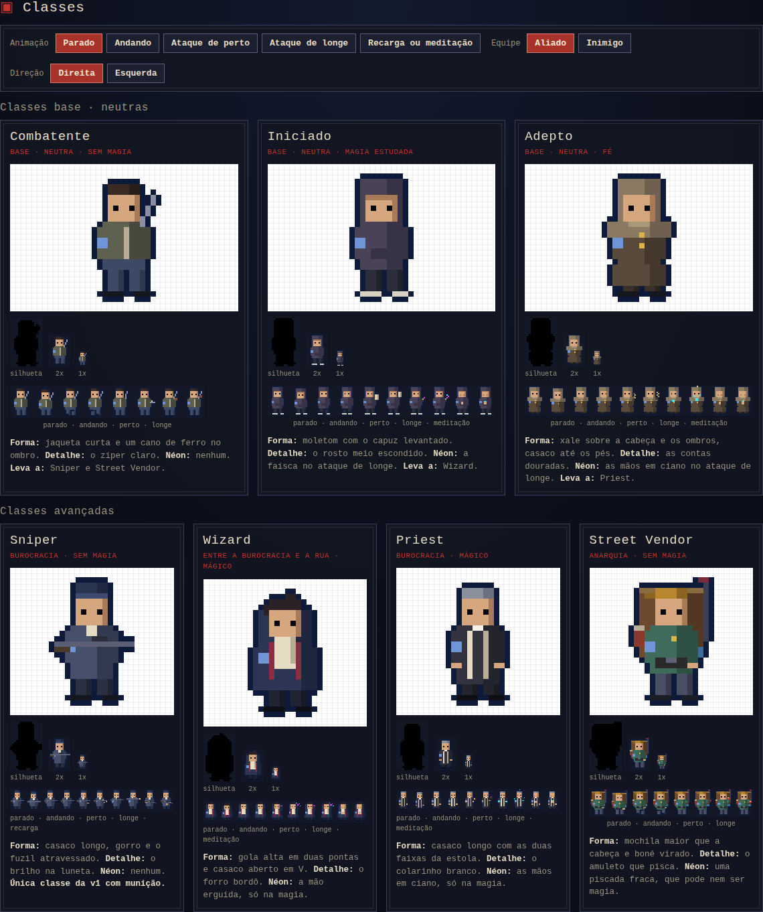

# Eldritch Alley: Tactics, v1 characters (handoff)

Consolidated prototype for the seven v1 classes: appearance, animations, basic attack, reload and meditation, and team readability. It is a reference for the game client, not production code: no server and no game rules beyond what is described here.

Handoff target: Claude Code, in the `eldritch-alley` repository. Follow `CLAUDE.md`: plan first, small diffs, no commits or pushes.

This package supersedes the earlier `eldritch-alley-character-prototypes` handoff (separate sprites and attack pages).

## Contents

```
index.html          the consolidated prototype (open directly in a browser, no build)
css/styles.css      page styles (Occult Bureaucracy tokens)
js/characters.js    class definitions and sprite drawing, outline, attack/reload/meditation
                    timelines and effects, team markers, scene
assets/
  spritesheet-ally.png, spritesheet-enemy.png        16×24 frames, 1x
  spritesheet-ally@4x.png, spritesheet-enemy@4x.png  same at 4x, for review
screenshots/        classes, attack, reload, both meditations, scene with team markers
```

UI strings are in Portuguese (the current prototype language); translate when moving into the client.



## 1. Classes and appearance

### Art direction rules

- **Low-poly 2D pixel art:** silhouette first, flat colors with two tones per surface (base and shadow), light from the left, one signature detail per class.
- **Size:** 16×24 px per frame, feet at the bottom center.
- **Neon only for magic:** magenta `#ff3df2` and cyan `#3de9ff`. Everything mundane is ink and fabric.
- **City clothes only:** no robes, pointed hats or armor.
- **Generated outline:** every transparent pixel touching the sprite becomes the outline, in the team color (see `outline()`).
- **Base classes are neutral:** no badges, uniforms or street flair; inclination only shows on advanced classes.

### The seven v1 classes

| Class | Type | Resource | Shapes | Signature detail |
|---|---|---|---|---|
| Combatant | Base, no magic | None | Short jacket, iron pipe on the shoulder | Light zipper line |
| Initiate | Base, studied magic | Mana | Hoodie with the hood up | Face half hidden by the hood |
| Adept | Base, faith | Mana | Shawl over head and shoulders, long coat to the feet | Gold beads on the chest |
| Sniper | Advanced, bureaucracy, no magic | Ammo | Long coat, beanie, rifle across the body | Scope glint |
| Wizard | Advanced, between bureaucracy and the street, magic | Mana | High two-point collar, open coat in a V | Burgundy lining |
| Priest | Advanced, bureaucracy, magic | Mana | Long dark coat with two light stole stripes | White clerical collar |
| Street Vendor | Advanced, street, no magic | None | Backpack bigger than the head, backwards cap | Blinking amulet |

Progression in v1: Combatant → Sniper, Street Vendor. Initiate → Wizard. Adept → Priest.

### Animations (two frames each)

| Animation | Notes |
|---|---|
| Idle | Frame 2 drops the upper body 1 px (breathing) |
| Walk | Legs alternate |
| Melee attack | Windup and strike; the variant shown when the target is adjacent |
| Ranged attack | Windup and release; the variant shown when the target is 2+ cells away |
| Reload (Sniper) | Rifle lowered and angled, hand to the magazine; then new magazine in |
| Meditation (mana classes) | Eyes closed, hands joined at the chest; frame 2 lights the hands in cyan |

Only the front view exists, mirrored for the opposite direction. Back views are not done yet.

### Spritesheet layout (`assets/`)

- **Rows**, top to bottom: Combatant, Initiate, Adept, Sniper, Wizard, Priest, Street Vendor.
- **Columns**, 16 px each: idle 1, idle 2, walk 1, walk 2, melee 1, melee 2, ranged 1, ranged 2, resource 1, resource 2.
- **Resource columns:** reload for the Sniper, meditation for mana classes, idle for classes without a resource.
- Exported with time-based blinks off (scope glint, amulet blink); those are runtime effects. Ground effects (magic circle, light beam) and projectiles are not in the sheet; they are drawn separately (section 3).

## 2. Combat rules shown in the prototype

- **One basic attack per class.** Damage, effect and cost are the same at any distance.
- **Only the animation changes with distance:** melee animation when the target is adjacent, ranged animation from two cells away.
- **Ammo:** shooting classes shoot at both distances (Sniper: pistol up close, rifle at range), and every shot spends ammo.
- **Mana works as ammo for magic classes:** every basic attack of Initiate, Adept, Wizard and Priest spends mana, at both distances. Because of that, even their melee attacks release a little magic on impact (see the table below).
- **Reload and meditation** take the unit's action for the turn and refill the resource (ammo or mana) to full. Prototype capacity: 3.
- **Resource display:** three pips above the head, warm `#f0d9a0` for ammo, cyan `#3de9ff` for mana.

### Basic attack animations

| Class | Melee (adjacent) | Ranged (2+ cells) |
|---|---|---|
| Combatant | Pipe strike | Brick thrown in an arc |
| Initiate | Notebook strike; uncontrolled magic escapes as a magenta spark on impact | Neon spark |
| Adept | Rosary strike that glows cyan on impact | Weak, flickering cyan beam |
| Sniper | Pistol shot | Rifle shot with a warm tracer |
| Wizard | Arcane gust of wind | Magic missiles: three neon darts on curved paths |
| Priest | Prayer book strike that glows cyan on impact | Cyan column falling from the sky onto the target |
| Street Vendor | Umbrella strike | Bottle thrown in an arc, shattering on impact |

### Reload and meditation

| Classes | Action | Effect |
|---|---|---|
| Sniper | Reload | Empty magazine drops to the ground, ammo pips refill one by one, bolt click at the end |
| Initiate, Wizard | Arcane meditation | A magic circle rotates on the ground under the unit (magenta outer ring, cyan inner ring, orbiting dots, counter-rotating triangle); neon particles rise |
| Adept, Priest | Faith meditation | A cyan light beam descends onto the unit, a soft glow where it touches the ground, light motes falling through the beam |

## 3. Timelines (milliseconds, normal speed)

### Basic attack

| Phase | When | What happens |
|---|---|---|
| Windup | 250 to 520 | Action frame 1 |
| Strike | 520 to 760 | Action frame 2; melee lunges 3 px toward the target; the resource pip is spent here |
| Travel | from 600 | Ranged only: 140 (shots, beams), 300 (sky column), 480 (thrown arcs), 520 (missiles, staggered 70 per dart) |
| Impact | travel end, 260 long | Target flashes white and shakes 1 px; impact particles |
| Recover | until 2000 | Back to idle (the prototype loops) |

### Reload and meditation

| Phase | When | What happens |
|---|---|---|
| Start | 300 | Reload frame 1 or meditation begins; ground effect fades in over 200 |
| Second half | 760 to 1180 | Reload frame 2; pips refill one every 140 |
| End | 1180 | Ground effect fades out over 160; Sniper bolt click |

Effect kinds, colors and timings live in `ATTACKS`, `RELOAD` and `drawStage()` in `js/characters.js`.

## 4. Team readability

The 2 px armband alone does not distinguish teams at game scale. The prototype uses all of these (see `screenshots/scene-team-markers.png`):

1. **Ground marker:** a diamond under each unit in the team color; enemy diamonds have small squares on the corners, so teams differ by shape as well as color.
2. **Team outline:** allies `#0d1a3a`, enemies `#3a0a0a`.
3. **Health bar** above the head, in the team color. Open question: always visible, or on hover and selection with a key to show all.
4. **Facing:** at match start, each team faces the other.
5. **Armband** stays as an identity detail: allies `#6f95d6`, enemies `#d9473d`.

## 5. How to apply this to the client

Suggested slices, one PR each. Write a plan for each slice and wait for approval before coding.

1. **Sprite module.** Port the class definitions into the client as data plus drawing functions, or load the exported spritesheets. Recommended: generate textures at boot from the drawing functions (canvas to texture), which keeps team variants and future equipment layers cheap. Keep the automatic outline.
2. **Unit rendering.** Replace placeholder sprites in the battle scene; add ground markers, team outline, health bar, resource pips and initial facing.
3. **Animation player.** Idle and walk loops; action, reload and meditation played from the timelines above.
4. **Combat presentation.** The client receives server events (attack, reload, meditate) and picks the melee or ranged animation by adjacency. Presentation never changes the outcome: the server already decided it.
5. **Effects.** Projectiles, arcs, beams, sky column, impact feedback, magic circle and light beam, as data-driven effect kinds.

### Engine and server notes

- Each class has a resource: none, ammo or mana, with a capacity (3 in the prototype).
- The basic attack is one action with one cost; distance never changes damage or cost.
- Reload and meditation are actions that refill the resource and use the unit's action.
- Distance is decided on the server; the client only uses it to choose the animation.

## Out of scope

Back views, layered sprites for equipment (planned for v2), sounds and final art. These prototypes define shapes, colors and timing; final sprites can be redrawn on top of the same rules.
