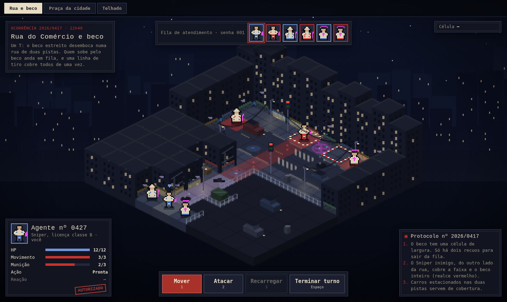

# Eldritch Alley: Tactics, map prototype

Visual and level design prototype for three battle maps, in the "Occult Bureaucracy" art direction. It is a reference for the real client (Phaser), not production code: there is no game logic, no server and no input beyond hover.



## Run

No build step. Open `index.html` in a browser, or serve the folder:

```bash
npx serve .
```

Fonts (Special Elite and IBM Plex Mono) load from Google Fonts; without network the page falls back to system monospace fonts.

## Files

```
index.html        markup: map tabs, canvas and HUD overlays
css/styles.css    HUD design tokens and components
js/data.js        palette, tile types, the three map definitions and placeholder sprites
js/app.js         isometric renderer, props, backdrops and HUD wiring
screenshots/      one capture per map
```

UI strings are in Portuguese (the current prototype language). Translate when this moves into the client.

## Art direction: Occult Bureaucracy

- **Setting:** magic is regulated like a public service. Agents are numbered and licensed; the HUD reads like case files: carbon-paper panels, typewriter titles, a red "AUTORIZADO" stamp, a numbered protocol log, a "service queue" for initiative.
- **Core visual rule:** the mundane is ink and paper; only magic glows. Neon (magenta `#ff3df2`, cyan `#3de9ff`) is reserved for esoteric effects and leaks. Every other light is warm and dim (`#f0d9a0`). This mirrors the attributes: Nerve (physical world) and Attunement (esoteric world).
- **One accent color:** stamp red (`#c8322a`) for the primary action and markings. Allies use ink blue (`#6f95d6`), enemies stamp red.
- **Dark and consistent:** HUD and map share the same night palette, so panels never look pasted on top of the scene.

| Token | Value | Use |
|---|---|---|
| `--bg` | `#0b0e18` | Page background |
| `--panel` | `rgba(19,22,34,.94)` | HUD panels (carbon paper) |
| `--ink` | `#e6dcc4` | Text (aged paper) |
| `--muted` | `#9b937f` | Secondary text |
| `--accent` | `#c8322a` | Stamp red, primary action |
| `--ally` / `--enemy` | `#6f95d6` / `#c8322a` | Team colors |
| neon | `#ff3df2`, `#3de9ff` | Magic only |

## Level design intent

| Map | Intent | How the layout delivers it |
|---|---|---|
| **Street and alley** | Punish large groups | A T: a one-cell-wide alley opens onto a two-lane street. Units in the alley walk single file and are exposed to line attacks; there are only two recesses (crates, dumpster) to step out of line. The enemy sniper across the street covers the crosswalk and the whole alley (red dashed overlay). Parked cars are the only cover while crossing. |
| **City park** | Open, flat terrain | Long sight lines and little cover: paths, benches, lamps, a fountain in the middle, a pond and a small mound. The opposite of the alley. |
| **Rooftop** | Verticality | Levels from 4 to 8. The player starts on the lowest terrace and has to climb; the machine-room platform (level 8) and the neighbor's raised slab are the high ground. A plank over the gap between two buildings is the only crossing: a risky corridor. |

### Design rules these maps surfaced

- **Line attacks** (piercing shot, burst) are what make the alley work. The engine needs a "line" target shape when abilities become data.
- **Falling:** a push on the plank is the obvious play. Decide what happens to a unit that falls (height damage or death).
- **Isometric occlusion:** tall buildings on the camera-facing side hide what is behind them. That is why the alley's front side is a low fenced parking lot. Either maps follow this rule, or the client fades buildings that cover units.

## Map data format (`js/data.js`)

Each map in `MAPS` has:

- `tiles`: 10 strings of 10 characters, one per row (`y`), indexed by column (`x`).
- Heights: `hmap` (explicit 10×10 numbers), or `h(x, y, tile)` (function), or `heights` (per tile type).
- `props`: `{ t: type, x, y }` objects. Some props block movement: car, dumpster, tree, fountain, water tower, crates, AC unit, kiosk, solar panel, vent.
- Optional: `threat` (cells highlighted as a line of fire), `wires` and `lines` (cables and a clothesline between cells), `fireEscape`, `door`, `shops`, `fence`, `parapet`, `center` (lane line row), `lift` (vertical offset).
- `units`: `[id, class, team, x, y]`.

| Tile | Meaning |
|---|---|
| `B` | Building (blocked) |
| `a` / `z` | Asphalt / crosswalk |
| `s` | Sidewalk |
| `x` | Alley |
| `f` | Fenced parking lot (blocked) |
| `g` / `p` / `q` / `w` | Grass / path / plaza / water |
| `r` / `R` | Roof slab / roof gravel |
| `v` / `k` | Gap down to the street / plank over the gap |

## Rendering notes (`js/app.js`)

- The scene is drawn at low resolution on an offscreen canvas and scaled up with nearest-neighbor, which keeps the pixel-art look.
- Isometric projection: `screenX = OX + (x − y) · 16`, `screenY = OY + (x + y) · 8 − height · 8` (tile 32×16, 8 px per height level).
- Cells are drawn back to front by `x + y`; props and units are drawn with their cell.
- Sprites are 14×17 placeholders generated from code and recolored per team. They stand in for real art.

## Known limitations

- Placeholder sprites; no animation beyond idle bob and ambient effects.
- Hover shows cell info only; movement range and attack highlights are static examples.
- Desktop first; it works on mobile but was not tuned for it.
