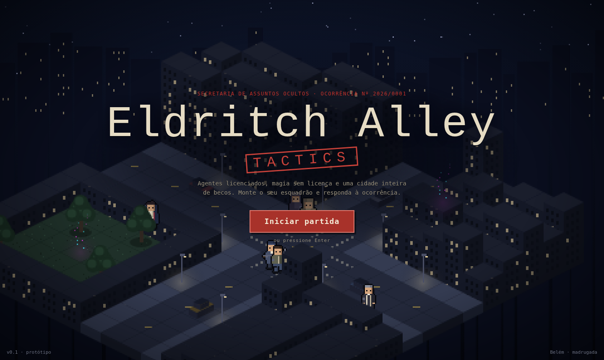

# Eldritch Alley: Tactics, title screen (handoff)

Prototype of the game's title screen: a living isometric city in the background, the v1 characters walking around and playing their animations, the game name in the middle and a call to action to start a match. It is a reference for the game client, not production code.

Handoff target: Claude Code, in the `eldritch-alley` repository. Follow `CLAUDE.md`: plan first, small diffs, no commits or pushes.

It builds on two earlier handoffs and reuses their rules: `eldritch-alley-map-prototype` (maps and art direction) and `eldritch-alley-characters-v1` (sprites, animations, effects). The character drawing code inside `js/title-screen.js` is the same as in the characters handoff.



## Contents

```
index.html             markup: canvas, title block, call to action, footer
css/styles.css         title typography, stamp, button, legibility shade
js/title-screen.js     character sprites, city generation and rendering, walkers, ambient actions, button
screenshots/           desktop, after pressing start, mobile
```

Open `index.html` directly in a browser. No build step. UI strings are in Portuguese; translate when moving into the client.

## Composition

- **Background:** a 16×16 isometric neighborhood in pixel art, drawn at low resolution and scaled up with nearest-neighbor. Two crossing streets (lane markings, crosswalks), sidewalks, street lamps with warm light, parked cars, a small park with trees, and two esoteric leaks emitting neon particles. A starry sky with a distant skyline.
- **Buildings:** tall at the back, low at the front, following the isometric occlusion rule from the maps handoff, so they never hide the characters.
- **Placement:** the street intersection sits just below the call to action (about 70% of the screen height), so walkers are visible around the button and the title sits over the dense back blocks.
- **Legibility:** a radial dark shade behind the title block and a vignette at the edges.

## Title block

| Element | Content | Style |
|---|---|---|
| Header | "Secretaria de Assuntos Ocultos · Ocorrência nº 2026/0001" | Small, stamp red `#c8322a`, wide letter spacing |
| Title | "Eldritch Alley" | Special Elite (typewriter), paper `#e6dcc4`, large |
| Subtitle | "TACTICS" | Red stamp: 3 px border `#d9473d`, rotated −4°, wide letter spacing |
| Tagline | One short line about the setting | Muted `#9b937f` |
| Call to action | "Iniciar partida" | Stamp-red button `#a8322a` with a hard offset shadow; Enter also triggers it |
| Feedback | "PARTIDA AUTORIZADA" stamp | Slams onto the screen (scale and fade, 180 ms) and leaves after 1.6 s |
| Footer | Version and "Belém · madrugada" | Small, dim |

Neon is not used in the title: the mundane is ink and paper, only magic glows (art direction rule).

## Characters in the background

All seven v1 classes walk loops on the sidewalks at 0.9 cells per second, facing the direction of movement (front view mirrored). They wear a neutral gray armband: there are no teams on the title screen.

Every few laps, each one stops for 2.4 s and plays an ambient action:

| Class | Ambient action |
|---|---|
| Sniper | Reload: magazine drops, new one in |
| Wizard | Arcane meditation by the park: rotating magic circle, rising neon particles |
| Initiate | Arcane meditation |
| Priest, Adept | Faith meditation: cyan light beam from the sky, falling light motes |
| Street Vendor | Throws a bottle that shatters on the sidewalk |
| Combatant | Pauses and breathes (idle) |

Walkers are drawn in depth order together with the city cells (by `x + y`), so buildings and props occlude them correctly.

## How to apply this to the client

Suggested slices, one PR each. Write a plan for each slice and wait for approval before coding.

1. **Title scene.** A dedicated scene (for example a Phaser scene) with the city backdrop. Prefer a fixed, hand-authored map in the same data format as the battle maps over the procedural generator used here.
2. **Ambient walkers.** Reuse the sprite module and animation player from the characters handoff; walkers follow waypoint loops and trigger ambient actions on a timer.
3. **Title overlay.** The title block and call to action as DOM over the canvas or as scene UI, keeping the typography and stamp styling.
4. **Start flow.** The call to action (and Enter) leads to team selection or matchmaking; keep the "PARTIDA AUTORIZADA" stamp as the transition.
5. **Performance and accessibility.** Cache sprites (the prototype caches by class, animation, frame and facing), pause the animation when the tab is hidden, and respect `prefers-reduced-motion` by slowing or stopping walkers and effects.

## Known limitations

- Front view only: characters walking away from the camera still face it. A back view is the natural next step for the sprites.
- The city is procedural and static (no camera movement).
- Desktop first; on mobile the composition works but the characters are small.
