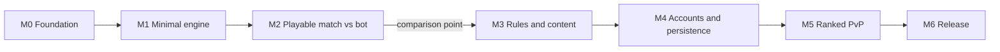

# Delivery roadmap: Eldritch Alley: Tactics

Based on [pitch.md](pitch.md) (MVP scope) and the state of the repository.

## Current state

| Package | Status |
|---|---|
| `backend/engine` | Only `ENGINE_VERSION` and one test. No game rules implemented. |
| `backend/game-server` | Starts Colyseus over WebSocket, no rooms yet. |
| `backend/platform-api` | NestJS with `/health`. No database, no authentication. |
| `frontend` | Phaser with a boot scene that shows the title. |
| Infra | Docker Compose with Postgres, Redis, LocalStack and a single Dockerfile. |

Not yet built: combat rules, persistence, login, match client, CI.

## Order and principles

1. **Engine first.** Rules, height, line of sight and initiative are the core of the game. The server, platform and client depend on the engine API.
2. **Vertical slice early.** M2 delivers a complete match against the bot, even if rough and without accounts. This validates the game before investing in the platform.
3. **Bot before PvP**, as the pitch defines.
4. **Each milestone ends with something playable or verifiable**, not just finished code.
5. **Comparison MVP.** This project is being compared with another game (Wizard Battle) built to the same point. The end of M2 is the comparison point. Only the chosen project continues to M3 and later.

Parallel track: once the event API from M1 stabilizes, the client can be developed against a mocked server while the game server is built.

## Decisions

The decisions below are recorded as ADRs in [docs/adr/](docs/adr/).

| Decision | Milestone | ADR |
|---|---|---|
| Individual initiative | M1 | [0001](docs/adr/0001-individual-initiative.md) (Accepted) |
| One resource per class | M3 | [0002](docs/adr/0002-one-resource-per-class.md) (Accepted) |
| Permanent death within a match | M1 | [0003](docs/adr/0003-permanent-death.md) (Accepted) |
| PvP turn timer (30 s hypothesis) | M5 | [0004](docs/adr/0004-pvp-turn-timer.md) (Proposed) |
| Deterministic engine with integer math | M1 | [0005](docs/adr/0005-deterministic-integer-engine.md) (Accepted) |
| NestJS 11 instead of 12 | M4 | [0006](docs/adr/0006-nestjs-11.md) (Accepted) |

Open, with no ADR yet: whether the setting shares the Magia Urbana universe. It does not affect code. It affects names, tone and art, and must be decided before M3 (content).

## Milestones

Sizes are relative (P, M, G) and have no dates, because they depend on team availability.

### M0. Foundation (P, done)

- [x] Monorepo with workspaces, scaffolds and Docker Compose.
- [x] Project renamed to `eldritch-alley`, documentation and comments in English.
- [x] Architecture decisions recorded in `docs/adr/`.
- [x] `CLAUDE.md` with the project rules.
- [x] CI with typecheck, test and build on every pull request (green on develop, run 37134898835).

**Done when:** CI is green on every pull request, and the ADRs are merged.

### M1. Minimal engine (G, critical)

- 8×8 grid with a height level per cell (ground, first floor, rooftop).
- Movement with a cost per height and a limit on climbed levels per step, per class.
- Initiative by speed, with deterministic tie-breaking, and the initiative queue as public state (ADR 0001).
- A basic attack with range.
- Randomness only from a seed, with no `Math.random`, `Date` or clock (ADR 0005).
- Each accepted action produces an event. A function `applyEvents(seed, events)` rebuilds the final state.
- Integer math only (ADR 0005).

**Done when:** a hash test shows that the same seed and the same actions always produce the same final state, and the engine has no framework or I/O dependencies.

### M2. Playable match against the bot, in two steps. Comparison point at the end of M2-b.

M2 is split so the code can be finished and reviewed before any cloud resource exists.

#### M2-a. Playable match against the bot, local (code only) (G)

- Colyseus migrated to 0.18 first, with its ADR (ADR 0008). This closes the server-path high advisory of DT-08.
- Map 8×8 with three height levels, with the three MVP classes (Sniper, Wizard, Priest) as configuration. Basic attack only; the classes differ by data (range, health, movement, attack, speed).
- Ammunition for the Sniper is already implemented in M1 (ADR 0002 addendum), so it is not part of M2-a work. The Assaulter is data for M3.
- Client with Phaser and the Colyseus client: pick three units, play against the bot, see the grid with height as coloured tiles, move and attack with clicks, initiative queue and action log. No artwork.
- `BattleRoom` in the match server: one match per room, applies actions with the engine through its public contract, sends the public state and events.
- Bot with a utility heuristic: attack the weakest target in range, seek height, retreat when health is low.
- Anonymous session identity issued by the server. No login and no persistence.
- Reconnection: the server sends the full public state on return.
- No turn timer against the bot (the 30 s timer comes with PvP in M5).

**Done when:** a complete match is played in the browser against the bot, locally, until one side is eliminated, and a forced disconnect is recovered by reconnecting.

#### M2-b. Published version (deploy)

Every cloud resource needs its own approval before it is created.

- Frontend on Cloudflare Workers with Static Assets, at `eldritch.heronoa.com.br`.
- One match-server instance on AWS, proposed as a small EC2 instance running Docker Compose.
- Public access to the match server through a Cloudflare Tunnel at `eldritch-game.heronoa.com.br`. The client connects with `wss://eldritch-game.heronoa.com.br`. The instance has no inbound ports open to the internet.
- TLS: both names are first-level subdomains of `heronoa.com.br`. Cloudflare's documentation says Universal SSL covers the root domain and one level of subdomains on a full setup, so no extra certificate is needed. This holds only if the zone uses a full setup, which must be confirmed in the dashboard.
- Verification required before M2-b is closed:
    - Done: a real WebSocket connection through the tunnel, and the idle test. Result below. The idle timeout value is not stated in the Cloudflare docs; it was measured at ~125 s.
    - Pending: the reconnection test through the tunnel.
    - Result:

      **Cloudflare Tunnel WebSocket test (2026-10-03):** WebSocket traffic reaches the local origin through the tunnel at `eldritch-game.heronoa.com.br`. An idle connection with no traffic was closed after ~125 s (close code 1006). With a ping every 25 s, the connection stayed open for the full 10-minute test. The test ended by timeout (exit code 124), not by a drop: 23 pongs were received, from 26 s to 576 s. Requirement: game-server heartbeat must stay well below ~100 s, and clients must reconnect.

      Confirmed in the installed packages: `@colyseus/ws-transport` 0.16.5 defaults `pingInterval` to 3000 ms (`WebSocketTransport.mjs`, line 22). That is well below the ~100 s limit. It is a WebSocket-level ping sent by the server.

      **Pending, part of the M2-b acceptance test:** with a real Colyseus room through the tunnel, keep one turn idle for more than 2 minutes (server-initiated pings at the 3 s default) and confirm the client reconnects after a forced drop.

- **Gate before the public deploy:** the Colyseus 0.18 migration is done and `npm audit` shows no high advisory on the server path (DT-08). Already satisfied by M2-a, which must be merged first.

**Done when:** the same match is played in the browser on the published version, and the tunnel tests above are recorded. The comparison with Wizard Battle is decided at this point.

### M3. Rules and content (G). Only if this project is chosen.

- Line of sight and cover (walls, crates, cars), using an integer algorithm (ADR 0005).
- Direction bonus: attacks from behind and from the flank.
- Height advantage: range and accuracy.
- Resources: ammunition with reload, and mana with regeneration, one per class (ADR 0002).
- Abilities and classes read from data, not hard-coded in the engine.
- Balancing of the three classes.
- Map with contested high points, cover and at least two routes between the sides.
- Playtest: at least ten matches against the bot, with recorded adjustments.
- Universe decision, before this milestone's content.

**Done when:** playtest matches end with varied winners, not one dominant strategy, and the playtest is documented.

### M4. Accounts and persistence (G)

- `platform-api` with MikroORM and PostgreSQL: players, matches and events.
- Sign-up and login with a JWT issued by NestJS. The match server validates the token when joining a room.
- Choosing the three units before the match (no roster management).
- When a match ends, the match server publishes "match ended" with the events to a queue (SQS on LocalStack). The platform-api consumes it and stores the match.
- Replay endpoint and a replay screen in the client, using the same engine.
- Reconnection in the middle of a match.

**Done when:** a replay built from the stored events produces the same final state as the live match, and a match survives a client disconnection.

### M5. Ranked PvP (G)

- Matchmaking queue in Redis, pairing by rating with a range that widens over time.
- When paired, the match server creates a room with two human players.
- Turn timer (ADR 0004), with rules for disconnection and inactivity.
- Asynchronous rating update: the platform-api consumes "match ended" and updates the rating (simple Elo or Glicko).
- Colyseus presence and driver on Redis, so more than one match-server instance can run.

**Done when:** two players on different browsers find each other through the queue, play a match and see the rating updated afterwards.

### M6. Release (G)

- Backend: images in ECR, running on ECS Fargate behind an Application Load Balancer, with autoscaling.
- Frontend: Cloudflare Workers with Static Assets.
- Basic observability: structured logs, health checks for both services, match and error counts.
- Security: secrets kept out of the repository, rate limiting on actions, all validation on the server.
- End-to-end tests of a match against the bot and of a PvP match.
- Open playtest with a few players, collecting feedback.

**Done when:** two outside players can join, play PvP and finish the match without intervention.

## Out of the MVP

Everything in the MVP's out-of-scope list in [pitch.md](pitch.md), including progression, equipment and item drops, is described in the "Post-MVP: progression" section of the pitch. That section is direction, not scope: nothing in it enters milestones M0 to M6. Those items go into a later roadmap, after feedback from M6.

## Risks

- **Engine scope.** Height, line of sight and cover together are the hardest part. Mitigation: M1 has the minimum rules, and M3 adds the rest once real matches exist.
- **Determinism.** Any use of time, object ordering or randomness outside the seed breaks verification. Floating-point math breaks it across runtimes. Mitigation: integer math only (ADR 0005), and the hash test in CI from M1.
- **Isometric client.** It can take longer than expected. Mitigation: placeholder art until M3.
- **Balancing.** It needs playtests, and the time they take is often underestimated. Mitigation: time reserved in M3.
- **Tunnel and WebSockets.** Cloudflare Tunnel and long-lived connections may behave differently than expected. Mitigation: the verification listed in M2 comes before the milestone is closed.
- **Universe.** A late decision causes rework in names and art, not code. Mitigation: decide before M3.
