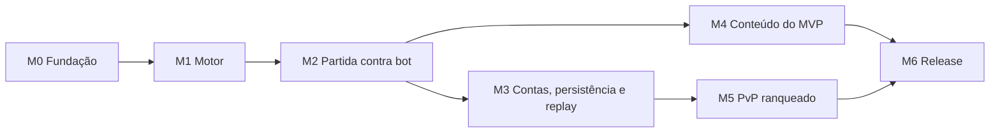

# Roadmap de entregas: Eldritch Alley: Tactics

Base: [pitch.md](pitch.md) (escopo do MVP) e o estado do repositório no commit `344160d`.

## Estado atual

| Pacote | Situação |
|---|---|
| `backend/engine` | Só `ENGINE_VERSION` e um teste. Nenhuma regra de jogo implementada. |
| `backend/game-server` | Sobe o Colyseus em WebSocket, sem salas. |
| `backend/platform-api` | NestJS com `/health`. Sem banco, sem autenticação. |
| `frontend` | Phaser com uma cena de boot que mostra o título. |
| Infra | Docker Compose com Postgres, Redis, LocalStack e Dockerfile único. |

Ainda não existe: regra de combate, persistência, login, cliente de partida, CI.

Divergências a resolver: o pitch fala em `client/` e o repositório usa `frontend/`. MikroORM e o cliente do Colyseus são citados no pitch, mas ainda não estão nas dependências.

## Ordem e princípios

1. **Motor antes de tudo.** Regras, altura, linha de visão e iniciativa são o núcleo do jogo. Servidor, plataforma e cliente dependem da API do motor.
2. **Fatia vertical cedo.** O M2 entrega uma partida inteira contra o bot, mesmo que feia e sem conta. Isso valida o jogo antes de investir em plataforma.
3. **Bot antes de PvP**, como o pitch define.
4. **Cada marco termina com algo jogável ou verificável**, não só com código pronto.

Trilha paralela: depois que a API de eventos do M1 estabilizar, o cliente pode ser desenvolvido contra um servidor simulado enquanto o game-server é feito.

## Decisões antes de codar

As perguntas em aberto do pitch têm impacto diferente. Algumas bloqueiam o M1.

| Pergunta | Bloqueia | Recomendação |
|---|---|---|
| Iniciativa individual ou por time? | M1 | Individual. O próprio pitch descreve "na sua vez, a unidade pode mover e agir", e é o modelo fiel à inspiração. |
| Munição e mana separadas, ou um recurso por classe? | M1 | Um recurso por classe. Armas usam munição, magia usa mana, como o pitch já sugere. Evita estado duplicado. |
| Morte permanente ou ressurreição na partida? | M1 | Permanente. Simplifica o modelo, e a ressurreição já é uma habilidade do Priest, então fica como efeito, não como regra. |
| Tempo por turno no PvP? | M5 | Começar com um valor fixo, por exemplo 30 s, e ajustar no playtest. É hipótese, não decisão. |
| Universo compartilhado com Magia Urbana? | M4 | Não afeta código. Afeta nomes, tom e arte. Decidir antes do conteúdo. |

Registrar cada decisão em um ADR curto (`docs/adr/`), para não reabrir a discussão depois.

## Marcos

Tamanhos são relativos (P, M, G), sem datas, porque dependem da disponibilidade do time.

### M0. Fundação (P, quase pronto)

- [x] Monorepo com workspaces, scaffolds e Docker Compose.
- [ ] Tomar as decisões acima e registrar em ADR.
- [ ] CI com `typecheck`, `test` e `build` em cada PR.
- [ ] Adicionar MikroORM ao `platform-api` e o cliente do Colyseus ao `frontend`, para o que os próximos marcos precisarem.

**Pronto quando:** CI verde e decisões registradas.

### M1. Motor determinístico (G, crítico)

- Grid 8×8 com nível de altura por célula (térreo, primeiro andar, telhado).
- RNG com seed próprio. Nada de `Math.random` no motor.
- Iniciativa por velocidade, com desempate determinístico, e a fila de turnos como estado público.
- Ações: mover (custo por altura e limite de degraus por classe), atacar, usar habilidade, recarregar e regenerar mana.
- Validação de cada ação: alcance, altura, linha de visão, recurso e vez. Ação inválida é rejeitada com motivo.
- Linha de visão e cobertura (muros, caixas, carros).
- Bônus de direção: costas e flanco.
- Vantagem de altura: alcance e acerto.
- Cada ação aceita gera um evento. Função `aplicarEventos(seed, eventos)` reconstrói o estado final.
- Classes e habilidades lidas de dados, não de código específico.

**Pronto quando:** testes de propriedade provam que mesma seed e mesmas ações geram mesmo estado final (comparação por hash), e cada regra tem teste próprio. O motor não tem dependência de framework nem de I/O.

### M2. Walking skeleton: partida contra bot no navegador (G)

- Mapa 8×8 com três níveis de altura e as três classes do MVP (Sniper, Wizard, Priest) como configuração.
- `BattleRoom` no game-server: cria a partida, aplica ações com o motor e envia só as diferenças.
- Bot com heurística de utilidade: atacar o alvo mais fraco ao alcance, buscar altura, recuar com pouca vida.
- Cliente mínimo: escolher três unidades, jogar contra o bot, ver grid com altura, mover e atacar com clique, fila de iniciativa e log de ações. Arte provisória.
- Sem login e sem persistência. Identidade anônima por sessão.

**Pronto quando:** uma partida completa é jogada no navegador até um dos lados ser eliminado.

### M3. Contas, persistência e replay (G)

- `platform-api` com MikroORM e Postgres: jogadores, partidas e eventos.
- Cadastro e login com JWT emitido pelo NestJS. O game-server valida o token ao entrar na sala.
- Escolha das três unidades antes da partida (sem gestão de elenco).
- Ao fim da partida, o game-server publica "partida encerrada" com os eventos numa fila (SQS no LocalStack). O platform-api consome e grava.
- Endpoint de replay e tela de replay no cliente, usando o mesmo motor.
- Reconexão no meio da partida.

**Pronto quando:** o replay gerado a partir dos eventos gravados produz o mesmo estado final da partida ao vivo, e uma partida sobrevive a uma queda de conexão do cliente.

### M4. Conteúdo do MVP (M)

- Balanceamento inicial das três classes, com as habilidades-base listadas no pitch.
- Mapa com pontos altos disputados, cobertura e pelo menos duas rotas entre os lados.
- Arte e identidade visual no nível do MVP, com o universo decidido.
- Playtest interno: pelo menos dez partidas contra o bot, com ajustes registrados.

**Pronto quando:** as partidas do playtest terminam com vencedores variados, não com uma estratégia dominante, e o playtest está documentado.

### M5. PvP ranqueado (G)

- Fila de matchmaking no Redis, pareando por rating com faixa que se alarga com o tempo.
- Ao parear, o game-server cria a sala com dois jogadores humanos.
- Timer por turno, com regra para desconexão e inatividade.
- Atualização de rating de forma assíncrona: o platform-api consome o evento de "partida encerrada" e atualiza o rating (Elo ou Glicko simples).
- Presença e driver do Colyseus no Redis, para rodar mais de uma instância do game-server.

**Pronto quando:** dois jogadores em navegadores diferentes se encontram pela fila, jogam uma partida e veem o rating atualizado depois do fim.

### M6. Release do MVP (M)

- Backend: imagens no ECR, execução no ECS Fargate atrás de um ALB, como no README.
- Frontend: Cloudflare Workers com static assets.
- Observabilidade básica: logs estruturados, health checks dos dois serviços, contagem de partidas e erros.
- Segurança: segredos fora do repositório, limite de taxa nas ações, validação de tudo no servidor.
- Testes ponta a ponta de uma partida contra o bot e de uma partida PvP.
- Playtest aberto com poucos jogadores e coleta de feedback.

**Pronto quando:** dois jogadores externos conseguem entrar, jogar PvP e terminar a partida sem intervenção.

## Fora do MVP

Progressão de classes e desbloqueio das avançadas, gestão de elenco, habilidade secundária, campanha PvE, mais mapas, equipamentos e visual 3D. Entram em um roadmap posterior, depois do feedback do M6.

## Riscos

- **Escopo do motor.** Altura, linha de visão e cobertura juntas são a parte mais difícil. Mitigação: o M2 começa com o conjunto mínimo de regras e cresce a partir da partida real.
- **Determinismo.** Qualquer uso de tempo, ordem de objetos ou aleatoriedade fora da seed quebra a verificação. Mitigação: teste de hash em CI desde o M1.
- **Cliente isométrico.** Pode consumir mais tempo que o esperado. Mitigação: arte provisória até o M4.
- **Balanceamento.** Exige playtest e tempo que costuma ser subestimado. Mitigação: M4 com tempo reservado.
- **Universo.** Uma decisão tardia gera retrabalho em nomes e arte, não em código. Mitigação: decidir antes do M4.
